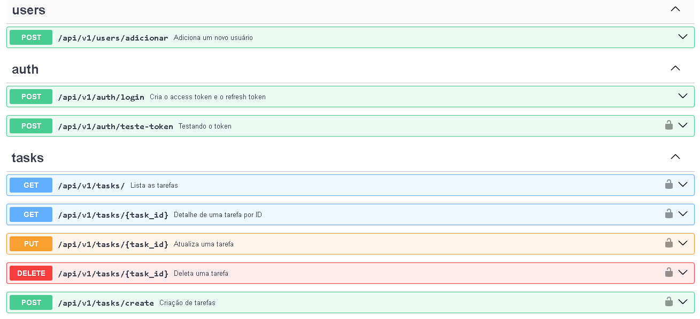

# API ToDo Fast 📖

Esse projeto é uma API RESTful para gerenciamento de tarefas, desde o cadastro de usuário, autenticação de usuario, geração de JWT Token e sua validação, criação, listagem, atualização e exclusão de tarefas.

## Como funciona ⚙️

Para ter acesso as funcionalidades, é preciso acessar o endpoint `/docs`. Outro ponto a ser destacado é que para a criação de tarefas e a geração do JWT token, é preciso estar autenticado com a conta que foi criada para poder ter acesso as funcionalidades da API, ou seja, para isso é preciso fazer o cadastro de usuário e autenticação de usuário.

1. Cadastro de usuário

 O cadastro de usuário é feito com o endpoint `/adicionar` e recebe os seguintes dados:
 - `email`: E-mail do usuário
 - `username`: Username do usuário
 - `password`: Senha do usuário

2. Autenticação de usuário

A autenticação de usuário recebe os seguintes dados:
 - `email`: E-mail do usuário
 - `password`: Senha do usuário

3. Geração de JWT Token

A geração e a validação de JWT Token é feita com o endpoint `/login` e recebe os seguintes dados:
 - `email`: E-mail do usuário
 - `password`: Senha do usuário

4. Criação, listagem, atualização e exclusão de tarefas

As tarefas são criadas, listadas, atualizadas e excluidas com seus determinados endpoints e inserida dentro do banco de dados MongoDB.

## Tecnologias utilizadas 🛠️

- FastAPI: Framework para desenvolvimento de APIs RESTful
- Pydantic: Validação de dados
- MongoDB: Banco de dados NoSQL
- JWT Token: Autenticação de usuário
- Typing: Tipagem de dados

## Como utilizar 🛠️

1. Crie um ambiente virtual com o seguinte comando e ative-o com o seguinte comando:

    `python -m venv .venv`

    `.venv/Scripts/activate`

2. Instale as dependências do projeto com o seguinte comando:

    `pip install -r requirements.txt`

3. Inicie o servidor com o seguinte comando:

    `uvicorn app.app:app --reload`

4. Acesse o endpoint `/docs` para utilizar a API:

    `http://localhost:8000/docs`

## Como contribuir 🤝🏻

Caso tenha interesse em contribuir para o projeto, sinta-se a vontade para fazer um pull request, seja com alguma correção ou melhoria, ou até mesmo com uma nova funcionalidade!
